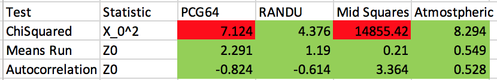
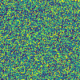
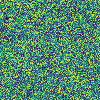
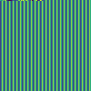
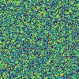

# Project 2 - Huang, Justin

## Problem Statement
How do we know if a random number generator (RNG) is 'good'? In this project we test a number of Unif(0,1) generators. We evaluate these RNG with formal statistical tests. The RNGs we will explore include:

* Numpy BitGenerator (PCG64)
* RANDU
* Middle Squares

The statistical tests we will use are:

* Chi Squared for goodness of fit (Uniforms)
* Means run test for independence
* Autocorrelation test for independence

In addition sometimes a simple eye test can give a lot of insight! 

## Background - Random Number Generators

### Numpy BitGenerator (PCG64)
This is the default RNG used in Python's numpy module. It is a PCG, which is short for permuted congruential generator. Developed in 2014, essentially it follows a linear congruential generator as a state-transition function, then uses permutation function as an output function.

### Randu
Randu is a linear congruential pseudorandom number generator of the Park–Miller type, and was developed in the 1960s. As mentioned in the course, drawbacks of the generator include correlation between points. In fact, each point lies in one of a set of 15 parallel planes 2^31 apart.

### Middle Squares
The midsquares method was developed by Von Neumann in 1949. It is an arithmetic method that takes a seed number and generates the next number by taking the middle n digits of the seed number, and squaring it. In this case, we use n=4. Example (if n=4:

### Atmospheric Noise/Other
Random numbers can come from all kinds of sources! One such source is from atmospheric noise, compiled from random.org.

## Background - Statistical Tests

### Chi-Squared Goodness of Fit Test for Correlation
In this test we begin with a hypothesis that the numbers are uniform. The test statistic is chi squared0 which is calculated by dividing the numbers into n bins and counting how many numbers fall into the individual bins and comparing these to the expected amount in each bin. This chi squared0 is compared to the chi squared, which can be determined by the significance and degree of freedoms. From this we can determine if there is evidence that supports that the numbers are uniform.
 are Unif(0,1)

if , we fail to reject 

### Runs Test Means
In this test we begin with a hypothesis that the numbers are independent. The test statistic is Z0 which is calculated by the number of runs above and below the mean. This Z0 is compared to the z value, which can be determined by the significance level and the normal distribution. From this we can determine if there is evidence that supports that the numbers are independent.

 are independent.

if , we fail to reject 

### Autocorrelation
This test provides another way to determine independence by looking at correlation between consecutive numbers.

 are independent.

if , we fail to reject .

## Results
10000 Pseudo Random numbers (PRNs) were generated from each generator and run through the statistical tests. Significance level of a=0.05 was used for all relevant tests. A summary table of results can be seen below.

Unsurprisingly the mid squares generator did not pass the chi squared test for uniform fit. Surprisingly in this instance the PCG generator from numpy did not pass the chi squared test for uniform fit. When tested in other conditions, it seemed the PCG generator did worse on the chi squared test as the number of PRNs went up.
RANDU and the atmospheric generator failed to reject the null hypothesis for all tests.

It is hard to say from these tests if any generator is 'good' or 'bad', but evidence points to the mid squares generator fitting very poorly to uniform distribution. What about a visual check?

Bitmaps were generated for each generator. The 10000 random numbers were fit to a 100x100 grid, and mapped to black or white pixels depending on the PRN values.

 PCG64 bitmap

 RANDU bitmap

 MidSquare bitmap

 atmospheric bitmap

From this it is very apparent that the mid squares is a 'bad' generator. The numbers don't seem random at all! 

From this exercise it is apparent that there is no one size fits all test to determine if a random number generator (RNG) is 'good' or 'bad'. The most rigorous approach would be to run a battery of statistical tests on each generator. This is just a sample of some of the tests taught in this course - other relevant tests include a permutations test, reverse arrangements test, and ranking tests. In addition to statistical tests, visualization of the data can be a powerful tool to determine the quality of a RNG. Histograms and autocorrelation plots could be used to supplement the battery of tests done.

